# Build WebApServer and DBServer using CloudFormation's NestedStack

## Diagram

## Construction steps

- Create an S3 bucket
  - Created with the name test-template-bucket
- Store 5 YAML templates in the above S3 bucket
- Creating the root stack
  - Enter DB password when creating stack
  - It takes about 15 to 30 minutes to create
- Check the created target group and confirm that the health check for the two EC2s is displayed as normal.
- Copy the ALB DNS name to access the web server
  - Refresh the page several times to ensure that the EC2 index.php for each availability zone is displayed.
- Select the connection from the created EC2 console and use the session manager to confirm that you can access RDS
  - Copy the endpoint name from the RDS console
    - mariadb -h dev-test-project-db.example.ap-northeast-1.rds.amazonaws.com -P 3306 -u admin -p
    - Check the same from the other EC2
